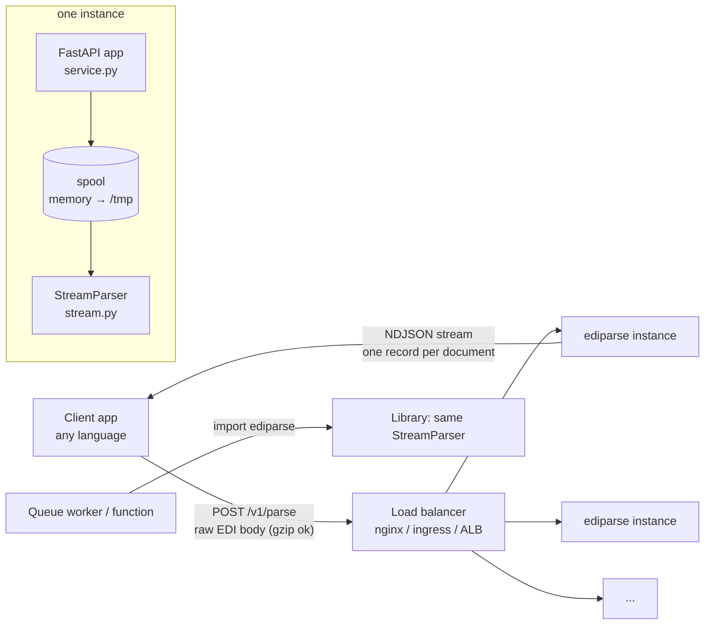
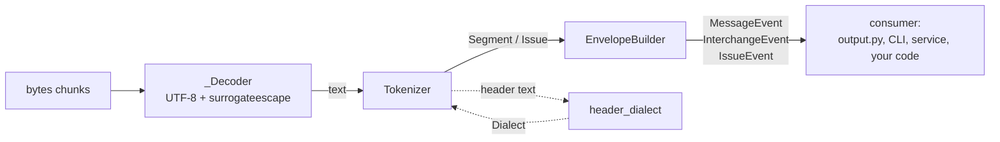
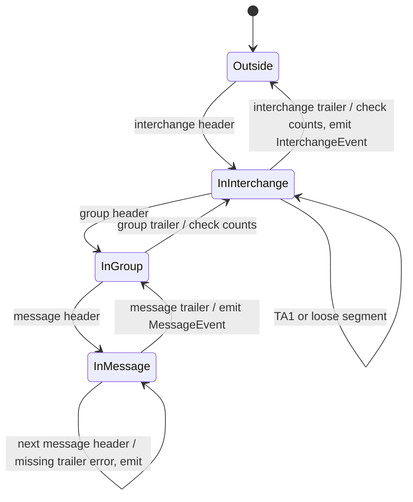
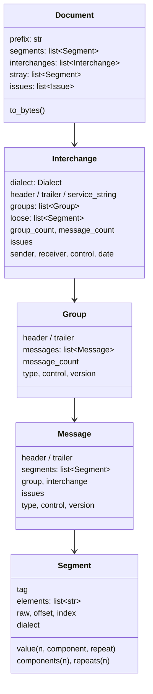
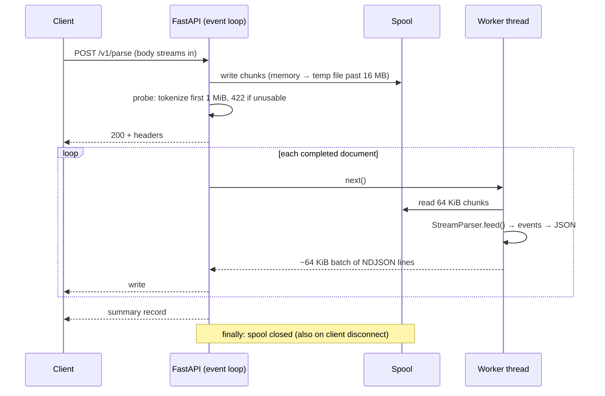

# Architecture

How the parser and service work, and why they're built this way.

## Contents

1. [System context](#system-context)
2. [Layers](#layers)
3. [Data flow through the parser](#data-flow-through-the-parser)
4. [Dialect detection](#dialect-detection)
5. [Incremental tokenizer](#incremental-tokenizer)
6. [Envelope builder and events](#envelope-builder-and-events)
7. [Data model](#data-model)
8. [Text decoding](#text-decoding)
9. [Error model](#error-model)
10. [The HTTP service](#the-http-service)
11. [Memory model](#memory-model)
12. [Concurrency and scaling](#concurrency-and-scaling)
13. [Design decisions](#design-decisions)
14. [Extension points](#extension-points)

---

## System context



Instances share nothing. Each request is handled from start to finish by one worker process in one instance.

## Layers

Each layer knows nothing about the layers above it. The bottom four need no knowledge of any document type.

| Layer | Module | Input → output | Needs a schema? |
|---|---|---|---|
| Dialect detection | `dialect.py` | header text → `Dialect` (standard, delimiters, version) | No |
| Tokenizer | `tokenizer.py` | text chunks → `Segment`s and `Issue`s | No |
| Envelope builder | `envelope.py` | segments → events (message, interchange, issue) + control checks | No |
| Streaming facade | `stream.py`, `parser.py` | bytes/files → events, or a full `Document` tree | No |
| Output | `output.py` | events → JSON dicts, CSV rows, summaries | No |
| Interfaces | `cli.py`, `service.py` | terminal / HTTP | No |
| *Loop resolution + labels* | *roadmap* | segments → named loops and fields | Yes (data files) |

Supporting modules: `model.py` (data classes and events) and `textutil.py` (handling of bytes that aren't valid UTF-8).

## Data flow through the parser



`StreamParser` wires these together. It's **push-based**: `feed(chunk)` returns the events that chunk completed,
and `close()` flushes the rest. The pull-style `stream(source)` and async `astream(source)` are thin loops around it,
so the CLI, the service, the library and the tests all exercise the same code path.

## Dialect detection

`dialect.py` turns the first few hundred characters of an interchange into a frozen `Dialect`:

```python
Dialect(standard="X12", element="*", component=":", segment="~", repetition="^", version="00501")
```

| Standard | Recognized by | How delimiters are read |
|---|---|---|
| X12 | `ISA` + a non-alphanumeric character | Element separator = 4th character. Then **count 16 separators**, not fixed offsets (that tolerates ISAs with trimmed padding). The component separator and terminator follow. `ISA11` is the repetition separator only if `ISA12 ≥ 00402` and it's a plausible delimiter, so a 4010 `U` is never treated as one |
| EDIFACT | `UNA` (6 service characters), or `UNB+` with defaults | Syntax version 4 (`UNB+UNOC:4`) adds `*` as the default repetition separator |
| TRADACOMS | `STX=` | Fixed delimiters |
| HL7 v2 | `MSH`/`FHS`/`BHS` + a separator | Field separator plus the four encoding characters |

Headers are only recognized at the **start of a token**. The regex has a lookbehind for a non-alphanumeric
character, so data such as `VISA*` isn't mistaken for an `ISA` header.

Detection happens at **every** interchange header, not once per file. One file can contain interchanges with
different delimiters, or different standards, and each is read correctly.

## Incremental tokenizer

`Tokenizer` accepts text in chunks of **any** size, down to one character, and returns each segment once it's
certain the segment is complete. Its core rule is in `_next()`:

> **Compute everything into locals; change no state until the segment is definitely complete ("commit").**
> If more input is needed, return `None` and the same text is retried after the next chunk arrives.

This rule is what makes results independent of chunking. A test checks it for every sample at chunk sizes from 1
upward, and the fuzzer checks it on hundreds of thousands of mutated inputs. Several bugs the fuzzer found were
violations of this rule (see [Testing](testing.md#bugs-found-by-testing)).

When the tokenizer waits for more input:

| Situation | Why it waits |
|---|---|
| Fewer than 9 characters left | A header such as `UNA` + 6 service characters may be incomplete |
| Header truncated (`TruncatedHeader`) | An ISA needs all 16 separators plus terminator |
| No terminator yet | The segment isn't finished |
| Terminator found, but only whitespace follows to the end of the buffer | More line-break characters may follow. They belong to this segment's `raw` |
| Searching for a header in junk | Keeps the last 9 characters: 8 that might start a header, plus 1 of lookbehind context |

What else the tokenizer handles:
- **Release characters** (EDIFACT/TRADACOMS `?`): a terminator preceded by an odd run of release characters is literal.
- **Wrapped lines** (80-column files): line breaks inside a segment are removed before splitting, with a single `wrapped_lines` notice.
- **Missing final terminator**: accepted at end of input, with an `unterminated_segment` warning.
- **Empty segments** (doubled terminators): skipped. Their text is appended to the previous segment's `raw` so round-trips stay exact.
- **Junk before the first header** (mail headers, banners, BOM): skipped and counted. It's kept as `Document.prefix` when the tree is retained.
- **Recovery from damaged headers**: if a header can't be read (e.g. an ISA whose terminator position holds a letter), the tokenizer emits a `bad_header` error, skips to the next header, and continues. The skipped text is kept for round-tripping. If no usable header exists anywhere, it raises `EDIDetectionError`.

Every `Segment` keeps `raw`: its exact source text including terminator and trailing line break. Joining all `raw`s
(plus the prefix) reproduces the input exactly.

## Envelope builder and events

`EnvelopeBuilder` is a state machine over the open interchange, group and message. One table drives all four
standards:

| Standard | Interchange | Group | Message |
|---|---|---|---|
| X12 | `ISA` / `IEA` | `GS` / `GE` | `ST` / `SE` |
| EDIFACT | `UNB` / `UNZ` (`UNA` attaches to the next `UNB`) | `UNG` / `UNE` | `UNH` / `UNT` |
| TRADACOMS | `STX` / `END` | — | `MHD` / `MTR` |
| HL7 | `FHS` / `FTS` | `BHS` / `BTS` | `MSH` / *(next MSH)* |



It emits three event types:

| Event | When | Carries |
|---|---|---|
| `MessageEvent` | A message closes (trailer read, or the next header implies it) | The message with its header, body, trailer, group/interchange context and its own issues |
| `InterchangeEvent` | An interchange closes | Header/trailer, counts, and envelope issues not tied to one message |
| `IssueEvent` | A problem occurs outside any interchange | The issue |

Each issue is attached to the **innermost open scope**: message, else interchange, else a standalone event. That's
why each record carries exactly the problems that concern it.

**Control checks** run when a trailer arrives:
- X12: SE01 segment count, SE02 = ST02; GE01 message count, GE02 = GS06; IEA01 group count, IEA02 = ISA13.
- EDIFACT: UNT/UNE/UNZ equivalents (UNZ01 counts groups if UNG is used, otherwise messages).
- TRADACOMS: MTR01 segment count; END01 message count.

**Retain vs stream.** With `retain=False` (streaming) the builder keeps only the open message and the open
headers, plus running counters for the checks. With `retain=True` (`parse_file`/`parse_text`) it also builds the
full `Document` tree.

## Data model



- `Segment.elements` holds **raw** element text, with escapes intact. The accessors (`value`, `components`, `repeats`) split and unescape on demand, so the cost is only paid for elements you read. Elements are 1-based (`seg.value(3)` is `BEG03`).
- `Group.messages` and `Interchange.groups` are filled only in retained mode. When streaming, use the counters and the events instead.
- Service segments whose elements *are* delimiters (`ISA`, `UNA`, and HL7 `MSH-1`/`MSH-2`) are never split.

## Text decoding

EDI should be ASCII or a declared charset, but real files contain stray Latin-1 or garbage bytes. The decoder must:
1. never fail
2. give **identical text however the bytes are chunked**
3. allow exact byte round-trips

| Approach | Problem |
|---|---|
| Strict UTF-8 | Fails on the first Latin-1 byte |
| UTF-8, switch to Latin-1 at the first bad byte | Text before the switch depends on where chunk boundaries fall. The fuzzer caught this |
| **UTF-8 with `surrogateescape`** (chosen) | Each invalid byte becomes a lone surrogate (U+DC80–U+DCFF). It's deterministic per byte and reversible exactly |

User-visible text (values, tags, delimiters, versions) goes through `textutil.display()`, which maps those surrogates
to their Latin-1 characters (`0xC9` → `É`). Non-UTF-8 EDI is almost always Latin-1 or Windows-1252. An
`invalid_utf8` notice is raised once, at the first segment containing such bytes. `output.dumps()` guarantees every
record encodes as UTF-8 JSON. An explicit `encoding=` (e.g. `cp1252`) decodes strictly in that codec instead.

## Error model

**The parser reports problems; it never stops for them.** Only "there is no usable EDI here at all" is an exception.

| Kind | Example | Surfaces as |
|---|---|---|
| Not EDI / no usable header | Plain text, or the only ISA is unreadable | `EDIDetectionError` (library), HTTP **422** (service), exit code **2** (CLI) |
| Envelope problem | SE count wrong, missing SE, stray segment, damaged later header | An `Issue` (`severity: error`) on the affected message or interchange. That record has `valid: false` |
| Irregularity | Wrapped lines, missing final terminator, junk before the header | An `Issue` with `warning` or `info` severity |
| Unexpected failure mid-stream | A bug | Service: final `{"type":"error"}` record. Clients must treat a response without a `summary` record as incomplete |

The [Output format](output-format.md#issue-codes) lists every issue code.

## The HTTP service



| Mechanism | Why |
|---|---|
| **Spool, then stream** | Answering while the upload is still arriving (full duplex) deadlocks common HTTP clients: they don't read the response until their upload finishes, and output is bigger than input. Spooling keeps memory bounded, because large uploads spill to disk |
| **Probe before 200** | Once a 200 is sent, errors can only be reported in-band. Tokenizing the first 1 MiB up front turns "not EDI" into a proper 422 |
| **Sync generator in a worker thread** | Parsing is CPU-bound. Starlette runs each step off the event loop, so health checks stay responsive |
| **~64 KiB write batches** | One thread hop per write instead of per document. This made the service about 2.3× faster in testing |
| **`_StreamingResponse` with guaranteed cleanup** | Closes the spool on completion, error **or client disconnect**. Without it, disconnects leaked `/tmp` space (found by testing) |
| **Raw body, not multipart** | Streams from disk with any client and has no parsing overhead. Multipart gets a 415 with guidance |
| **No state** | Any instance can serve any request, so scaling out is trivial |

## Memory model

Per parse:
- the tokenizer buffer (the current partial segment, at most one chunk + one segment)
- the open message (all its segments)
- the open interchange and group headers
- counters

**Memory is bounded by the largest single document, not the file size.** Measured: a 47 MB file of 150,000 claims
peaks at about 22 MB RSS in-process. A test keeps peak traced allocations under 1.5 MB for a 5 MB stream.

Per service request, add:
- the spool: up to `EDIPARSE_SPOOL_MEMORY_MB` (16 MB) in memory, the rest on `/tmp`
- the current output batch (about 64 KiB)

If `/tmp` is a tmpfs, as in the Compose file, spooled bytes count as container memory. See
[Operations → sizing](operations.md#sizing).

The one unbounded case is a single huge document (one ST/SE with thousands of claims), which is held in full because
it's returned as one record. Splitting such documents is on the [roadmap](roadmap.md).

## Concurrency and scaling

- **Inside a process:** each request is parsed by one thread. The GIL means one process uses about one core.
- **Inside an instance:** `WEB_CONCURRENCY` uvicorn worker processes. Use about one per core.
- **Across instances:** stateless, behind any round-robin load balancer. Tested with Compose (`--scale`) and Kubernetes (HPA scaled 2 → 10 pods under load, with no failed requests).
- **Rollouts:** uvicorn finishes in-flight requests on SIGTERM. Kubernetes gets a `preStop` delay and a 300 s grace period. Tested: a rolling restart during six in-flight 47 MB streams completed all six.

## Design decisions

| Decision | Alternatives considered | Rationale |
|---|---|---|
| Detect delimiters per interchange | Configure per partner | Zero configuration is the core promise. Files with mixed interchanges are common |
| One record per business document | Per file (too big, all-or-nothing); per segment (too chatty, loses context) | Matches how consumers act. It streams, and failures stay isolated |
| Push parser as the core | Pull-only iterator | One core serves sync, async, HTTP and the CLI. Tests can feed arbitrary chunkings |
| Report, don't raise | Fail fast | Real files are imperfect. Consumers decide what's fatal (`valid` flag) |
| Raw elements + lazy accessors | Pre-split everything | Cheaper. Escapes intact, so `raw` round-trips |
| `surrogateescape` decoding | Strict / switch-on-error | Chunking-independent and lossless (see [Text decoding](#text-decoding)) |
| Spool then stream (service) | Full duplex | Avoids client deadlocks while keeping memory bounded |
| Zero-dependency core | Use a parsing framework | Embeddable anywhere, small supply-chain surface. FastAPI/uvicorn only for `[service]` |
| NDJSON | One JSON array | Line-at-a-time streaming in every language. `format=json` is still available |
| Stateless service, no jobs | Async job queue | Simplest thing that scales. A jobs API is on the roadmap for very large batches |

## Extension points

- **A new standard:** add detection to `header_dialect()` (and `HEADER_RE`), a row to `envelope.SPECS`, and identity accessors (`type`, `control`, `version`) in `model.py`. Tokenizer, events, output and service need no changes. See [Development](development.md#adding-a-standard).
- **Loop resolution and field labels:** a layer that consumes `MessageEvent`s and annotates segments using data files (loop-start tables, element dictionaries). Planned; see the [roadmap](roadmap.md).
- **New output formats:** consume events in `output.py`. Anything that streams events works with the CLI and service unchanged.
