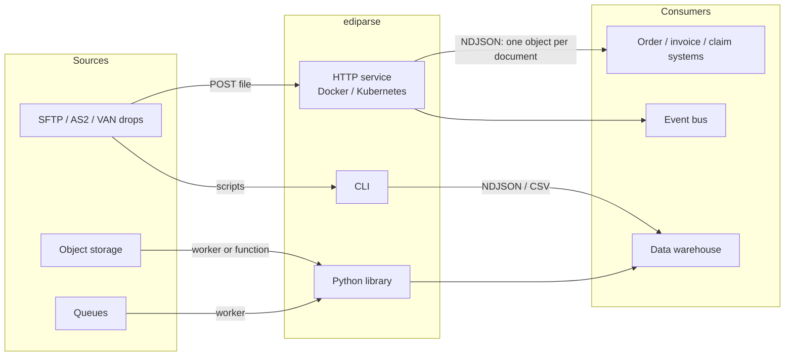

# Overview

## What it is

Universal EDI Parser reads electronic data interchange (EDI) files and turns each business document inside them into
a JSON object. Examples of business documents: a purchase order, an invoice, a healthcare claim, a shipment status.

It works **without mappings**. You don't configure it per trading partner or per document type. It reads the
delimiters and envelope structure straight from each file and returns every segment and element, with its position
and its envelope context.

It ships in three forms that share the same parser:

| Form | Use it when |
|---|---|
| **HTTP service** (Docker, Kubernetes, any container platform) | Several teams or languages need parsing as a shared capability |
| **Python library** (`pip install`, no dependencies) | Your code is already in Python, or runs in a queue worker or function |
| **CLI** (`ediparse`) | Ad-hoc inspection, scripting, batch conversion to NDJSON or CSV |

## The problem it solves

EDI is still the main format for B2B transactions in retail, logistics, manufacturing and US healthcare. Working with
it is usually painful:

- **Every partner configures files differently.** Delimiters, versions, optional segments and code values vary. Traditional translators need a mapping per partner per document before they can read anything.
- **The tooling is heavyweight.** Commercial translators and VANs are built for whole-company integration, not for a developer who needs the data out of an 837 claim file.
- **Files are large.** Healthcare claim and remittance batches run to hundreds of megabytes. Loading them into memory, or into a DOM-style tree, doesn't scale.
- **Real files are messy.** Wrapped lines, missing terminators, bad control counts, odd encodings, files with junk before the first header.

This project separates **reading** EDI from **interpreting** it. The reading part is universal and solved once
here: syntax, envelopes, control totals and streaming. What each field means for your business stays in your code,
working on clean JSON.

## Who it's for

- **Application developers** who receive EDI files and need the data: order intake, invoice processing, claims analytics, shipment tracking.
- **Platform teams** who want EDI parsing as an internal service that any team can call.
- **Data engineers** loading EDI into warehouses or lakes (NDJSON/CSV output, streaming, flat memory).
- **Integration and EDI analysts** who need to inspect, validate or debug files quickly (`ediparse -f tree`, `ediparse validate`).

## What it does

- Detects **X12** (4010, 5010 and other versions), **EDIFACT**, **TRADACOMS** and **HL7 v2** automatically, including delimiters, per interchange.
- Splits every file into **interchange → group → message** and returns **one JSON object per message** (business document).
- Gives every element a **positional ID** (`BEG03`, `NM103`, `PID-5`). It handles composites and repeats, and resolves escape characters.
- Checks **control totals and control numbers** (SE/GE/IEA, UNT/UNE/UNZ, MTR/END) and reports problems **per document**, so one bad document doesn't fail a batch.
- **Streams.** Memory stays flat regardless of file size. It is bounded by the largest single document.
- **Tolerates messy input** and recovers from damaged interchange headers by skipping to the next one.
- **Round-trips losslessly.** The parsed tree reproduces the input byte for byte.

## What it deliberately does not do (yet)

- **Interpret meaning.** It tells you `N101 = "ST"`, not that this is the ship-to party. Field labels and loop structure (e.g. the 837's 2000A/2300/2400 loops) are on the [roadmap](roadmap.md). The [document catalog](document-catalog.md) describes those structures.
- **Map to your schema.** Turning a parsed 850 into your order object is your code. That's the point of the separation.
- **Validate against implementation guides.** It checks envelope integrity, not whether an 837 obeys every HIPAA rule (SNIP levels 3+).
- **Generate EDI or transport it** (AS2, SFTP, VAN). It reads files; how they arrive is up to you.

## How the pieces fit

## Key design choices

| Choice | Why |
|---|---|
| Read delimiters from each interchange header | The only way to read any partner's files with zero configuration |
| One record per business document | It's the unit consumers act on (one order, one claim). It streams naturally, and failures stay isolated |
| Streaming everywhere | EDI batches are big. Memory must not depend on file size |
| Report problems, never stop | Real files are imperfect. A bad control count shouldn't hide 9,999 good claims |
| Core library has zero dependencies | Easy to embed anywhere, and a smaller supply-chain surface |
| Stateless service | Scale by adding instances. Nothing to coordinate or back up |

[Architecture](architecture.md) explains each of these in depth.
